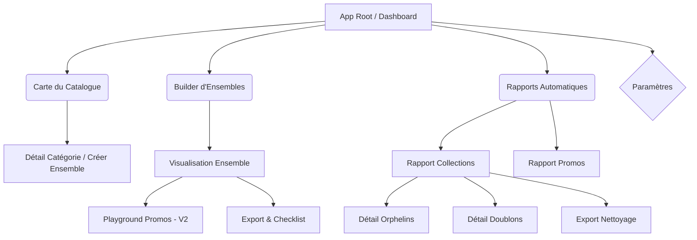
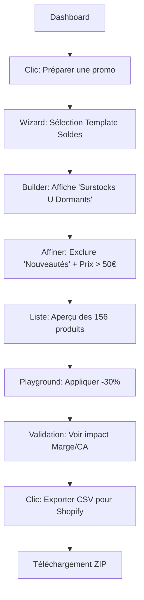
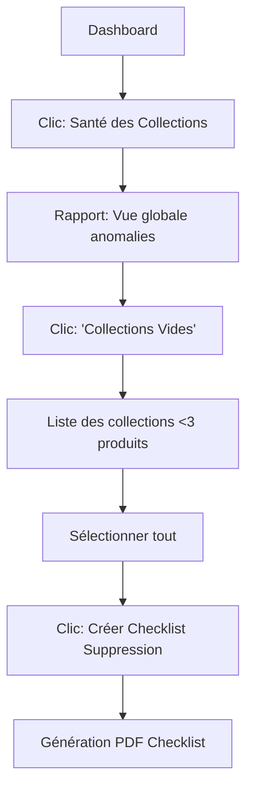

Voici la spécification Front-End détaillée pour le projet **Copilote Merchandising**, basée sur votre Product Requirements Document (PRD) v2.0 et structurée selon le modèle fourni.

-----

# Spécifications UI/UX : Copilote Merchandising Shopify

## Introduction

Ce document définit les objectifs d'expérience utilisateur, l'architecture de l'information, les flux utilisateurs et les spécifications visuelles pour l'interface du "Copilote Merchandising". L'objectif est de traduire la logique mathématique des ensembles (Set Theory) en une interface intuitive pour les E-commerce Managers sur Shopify.

  - **Fichiers de Design (Maquettes) :** *[Lien Figma à insérer]*
  - **Design System :** [Shopify Polaris](https://polaris.shopify.com/) (Le produit étant une app Shopify, l'utilisation de Polaris est impérative pour la cohérence et la vélocité).

## Objectifs UX & Principes

  - **Personas Cibles :**

      - **Marie (E-com Manager) :** Experte mais débordée. Cherche l'efficacité, la précision et la rapidité d'exécution pour les soldes/promos.
      - **Thomas (Fondateur DTC) :** Profil généraliste. Cherche une vision claire ("Big Picture") et des actions simples pour "nettoyer" sans casser son site.

  - **Objectifs d'Usabilité :**

      - **Compréhension immédiate :** Visualiser la structure du catalogue en \<30 secondes (Carte du catalogue).
      - **Sécurité perçue :** L'utilisateur doit sentir qu'il ne peut pas "casser" son Shopify par erreur (Confirmation explicite, actions manuelles via export).
      - **Fluidité des données :** Temps de réponse \<3s pour le calcul des ensembles.

  - **Principes de Design :**

    1.  **Pensée par Ensembles :** L'interface doit privilégier les opérations de groupe (croiser, exclure) plutôt que les listes infinies.
    2.  **Langage Métier :** Utiliser "Croiser avec", "Sauf les", "Orphelins" plutôt que des symboles mathématiques (∩, ∪).
    3.  **Actionnable First :** Chaque écran doit mener à une action (Export, Checklist, Modification).
    4.  **Divulgation Progressive :** Masquer la complexité (paramètres avancés) par défaut.

## Architecture de l'Information (IA)

  - **Sitemap / Inventaire des Écrans :**

<!-- end list -->

  - **Structure de Navigation :**
      - **Navigation Principale (Sidebar Polaris) :**
          - Tableau de bord (Vue d'ensemble)
          - Carte (Visualisation Treemap)
          - Builder (Outil de création)
          - Rapports (Collections, Promos, Santé)
          - Historique / Exports
      - **Navigation Secondaire :** Fil d'ariane (Breadcrumbs) pour la navigation dans les sous-ensembles et les rapports détaillés.

## Flux Utilisateurs (User Flows)

### Flux 1 : Préparation des Soldes (Scénario A)

  - **Objectif :** Identifier les produits en surstock et dormants, simuler une promo, et exporter la liste.
  - **Diagramme :**

<!-- end list -->

### Flux 2 : Nettoyage des Collections (Scénario B)

  - **Objectif :** Identifier et traiter les collections vides et les produits orphelins.
  - **Diagramme :**

<!-- end list -->

## Wireframes & Mockups

Les écrans doivent suivre strictement le **Shopify Polaris Design System** pour l'intégration native.

### 1\. Dashboard (Vue d'ensemble)

  - **Layout :** Grille de cartes (Cards).
  - **Éléments clés :**
      - KPI Santé Catalogue (Score /100).
      - Raccourcis "Recettes" (Nettoyage rapide, Prépa soldes).
      - Résumé des dernières synchronisations.
      - Alertes bloquantes (ex: "23 produits orphelins détectés").

### 2\. Carte du Catalogue (Catalog Map)

  - **Composant central :** Treemap interactive (D3.js ou Recharts).
  - **Interactions :**
      - Le survol affiche le volume (Stock ou Nb produits).
      - Le clic sur une "tuile" (ex: "Robes") ajoute ce filtre au *Builder* instantanément.
      - **Filtres de vue :** Switcher pour colorer la map par "Stock", "Ventes", ou "Prix".

### 3\. Builder d'Ensembles (Core Feature)

  - **Layout :** Split screen.
      - **Gauche (30%) :** Panneau de contrôle des opérations.
          - Blocs empilables : "Inclure [Filtre]", "Croiser avec [Filtre]", "Exclure [Filtre]".
          - Chaque bloc a un résumé en langage naturel (ex: "Produits en Stock \> 50").
      - **Droite (70%) :** Résultats en temps réel.
          - Compteur Sticky en haut ("342 Produits").
          - Liste (ResourceList Polaris) avec colonnes : Image, Titre, Stock, Prix, Métrique clé (ex: Jours sans vente).
  - **Footer Sticky :** Barre d'action "Exporter" ou "Simuler Promo".

### 4\. Rapports (Collections & Promos)

  - **Layout :** Master-Detail.
  - **Master :** Liste des problèmes détectés avec sévérité (High, Medium, Low).
  - **Detail :** Tableau de données filtrable avec cases à cocher pour action en masse (Export CSV).

## Référence Composants / Design System

L'application utilisera **Shopify Polaris React** (v12+).

  - **Composants clés à utiliser :**
      - `Page`, `Layout`, `Card` : Structure de base.
      - `ResourceList`, `IndexTable` : Affichage des listes produits/collections.
      - `Filters`, `ChoiceList` : Pour le Builder.
      - `Banner` : Pour les feedbacks et alertes (ex: "Attention, marge faible").
      - `Modal` : Pour la confirmation des exports.
      - `EmptyState` : Pour l'onboarding (ex: "Aucun ensemble créé").

## Branding & Style Guide

L'interface doit être "Invisible" et se fondre dans l'admin Shopify, mais avec des touches subtiles pour la visualisation de données.

  - **Palette de Couleurs (Extension Polaris) :**

      - Utilisation stricte des tokens Polaris (`--p-color-bg-surface`, `--p-color-text-default`).
      - **Couleurs sémantiques "Ensembles" :**
          - Intersection (Croiser) : `Indigo` (Logique).
          - Union (Ajouter) : `Teal` (Croissance).
          - Exclusion (Sauf) : `Rose` (Alerte/Retrait).
      - **Data Viz (Treemaps) :** Dégradés séquentiels (Bleu clair -\> Bleu foncé) pour le volume, Divergents (Rouge -\> Vert) pour la performance.

  - **Typographie :**

      - San Francisco / Inter (System font Shopify).
      - Usage de *Monospace* pour les SKU et les valeurs numériques dans les tables.

  - **Iconographie :**

      - Shopify Polaris Icons (`Major` versions).

## Exigences d'Accessibilité (AX)

  - **Cible :** WCAG 2.1 AA.
  - **Points critiques :**
      - **Couleurs :** Les Treemaps doivent avoir des bordures claires ou des motifs, ne pas dépendre uniquement de la couleur pour l'information (mode daltonien).
      - **Navigation Clavier :** Le Builder d'ensembles doit être entièrement manipulable au clavier (Tabulation entre les blocs de filtres).
      - **ARIA :** Les graphiques de données doivent avoir des descriptions textuelles (`aria-label` ou tableaux de données alternatifs).

## Responsiveness

  - **Stratégie :** Desktop First (l'outil est un outil de travail complexe).
  - **Breakpoints :**
      - **Desktop (\>1024px) :** Vue complète, Split screen pour le Builder.
      - **Tablet (768px - 1023px) :** Sidebar repliée. Le Builder passe en vertical (Panneau filtres au-dessus des résultats).
      - **Mobile (\<768px) :** Mode consultation uniquement.
          - Dashboard visible (KPIs).
          - Rapports en lecture seule.
          - Le Builder affiche un message "Passez sur Desktop pour éditer des ensembles complexes".

## Journal des Modifications (Change Log)

| Modification | Date | Version | Description | Auteur |
| :--- | :--- | :--- | :--- | :--- |
| Création initiale | 06/12/2024 | 1.0 | Création basée sur PRD v2.0 | Gemini |