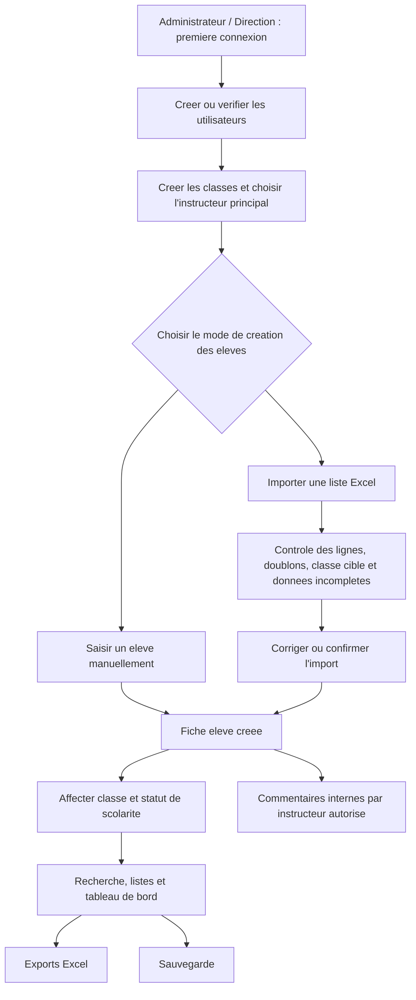

# PRD V1 - Gestion scolaire GS AIME CESAIRE TKB

Statut : validee par Ams

Date : 2026-06-13

Source : `docs/EXPRESSION_BESOIN.md`, validee par Ams le 2026-06-13

Validation : PRD V1 validee par Ams le 2026-06-14

## 1. Objectif du produit

Construire une premiere version simple d'une application de gestion scolaire pour GS AIME CESAIRE TKB, utilisable depuis un navigateur sur le reseau local de l'ecole.

La V1 doit permettre a l'ecole de centraliser les informations essentielles des eleves, des classes et du statut de scolarite, avec import/export Excel, recherche rapide, commentaires internes et tableau de bord simple.

## 2. Objectif de la V1

La V1 doit remplacer progressivement les cahiers et fichiers disperses pour le registre eleves/classes.

Elle doit etre utile meme sans modules avances de notes, bulletins, presences, comptabilite ou communication parents.

## 3. Utilisateurs cibles

### Administrateur / Direction

Responsabilites :

- acceder a toutes les donnees ;
- consulter le tableau de bord ;
- gerer les utilisateurs si la fonction est disponible en V1 ;
- affecter les instructeurs / enseignants aux classes ;
- exporter les listes ;
- superviser les donnees sensibles.

### Secretariat

Responsabilites :

- ajouter et modifier les fiches eleves ;
- importer une liste eleves par Excel ;
- gerer les classes et leur instructeur principal si autorise ;
- consulter et exporter les listes.

### Instructeur

Responsabilites :

- consulter les fiches eleves autorisees ;
- ajouter des commentaires internes de suivi ;
- modifier ses propres commentaires, selon regle V1.

Hypothese V1 :
le role `comptabilite` n'est pas cree separement. Le statut de scolarite est modifie par la direction ou le secretariat.

## 4. Perimetre fonctionnel V1

Inclus dans la V1 :

- authentification simple ;
- gestion des eleves ;
- gestion des classes ;
- affectation des instructeurs / enseignants aux classes ;
- fiche eleve ;
- recherche eleve ;
- statut de scolarite simple ;
- commentaires internes sur fiche eleve ;
- import Excel de liste eleves ;
- export Excel des listes essentielles ;
- tableau de bord simple ;
- sauvegarde et restauration documentees.

Hors perimetre V1 :

- notes ;
- moyennes ;
- bulletins PDF ;
- presences et retards ;
- emploi du temps ;
- portail parent ;
- messagerie parent ;
- WhatsApp ou email automatise ;
- encaissement ;
- recus ;
- factures ;
- montants dus ;
- historique financier detaille ;
- version hebergee accessible depuis Internet ;
- synchronisation multi-sites ou hors ligne avancee.

## 5. Workflow de prise en main V1

Objectif :
permettre a Ams, a l'ecole et au developpeur de visualiser l'ordre logique des actions lors de la premiere utilisation de l'outil.

La V1 doit guider l'utilisateur dans un enchainement simple :

### Ordre recommande de creation

| Ordre | Action | Responsable principal | Dependances | Type de saisie | Resultat attendu |
| --- | --- | --- | --- | --- | --- |
| 1 | Creer ou verifier les comptes utilisateurs | Administrateur / Direction | Application installee | Saisie utilisateur : nom, role, identifiant, mot de passe | Les profils Direction, Secretariat et Instructeur sont disponibles |
| 2 | Creer les classes actives et choisir l'instructeur principal | Secretariat ou Direction | Comptes instructeurs crees si rattachement souhaite | Saisie classe : nom, cycle optionnel, instructeur principal selectionne dans une liste | Les classes peuvent etre selectionnees dans les fiches eleves et reliees a leur instructeur principal |
| 3 | Preparer le modele Excel eleves | Secretariat | Classes connues | Fichier Excel avec colonnes attendues | Le fichier d'import respecte le format attendu |
| 4 | Importer les eleves ou les saisir manuellement | Secretariat | Classes existantes | Import Excel ou formulaire eleve | Les fiches eleves sont creees, rattachees a une classe et marquees completes ou a completer |
| 5 | Verifier le statut de scolarite | Direction ou Secretariat | Eleves existants | Choix simple : `a jour`, `non a jour`, `a verifier` | Le tableau de bord peut afficher les statuts |
| 6 | Consulter et completer les fiches eleves | Direction, Secretariat, Instructeur autorise | Eleves existants | Lecture fiche, commentaire interne, modification autorisee | Le suivi interne de chaque eleve commence |
| 7 | Rechercher, filtrer et controler les listes | Tous les utilisateurs autorises | Eleves et classes existants | Recherche texte, filtres classe/statut | Les utilisateurs retrouvent rapidement les informations |
| 8 | Exporter les listes utiles | Direction ou Secretariat | Donnees eleves suffisantes | Choix d'un export Excel | Les listes sont exploitables hors application |
| 9 | Lancer ou verifier la sauvegarde | Administrateur / Direction | Donnees creees | Action de sauvegarde ou controle procedure | Les donnees peuvent etre restaurees si besoin |

### Dependances fonctionnelles a respecter

- Une classe doit exister avant de pouvoir rattacher un eleve a cette classe.
- Un instructeur doit exister comme utilisateur avant de pouvoir etre affecte a une classe.
- Un eleve doit exister avant de pouvoir ajouter un commentaire de suivi.
- Un statut de scolarite doit etre choisi pour que le tableau de bord soit utile.
- L'import Excel depend du modele de colonnes ou d'une classe cible choisie si le fichier correspond deja a une seule classe.
- Les exports dependent des droits utilisateur et des donnees disponibles.
- La sauvegarde doit etre disponible avant une utilisation reelle durable.

### Types de saisies V1

- Saisie utilisateur : creation des comptes et attribution d'un role.
- Saisie classe : nom de classe, cycle optionnel, statut actif/archive, instructeur principal optionnel.
- Saisie eleve : formulaire manuel avec champs obligatoires.
- Saisie groupee : import Excel de plusieurs eleves.
- Saisie de completude : validation ou correction des champs manquants apres import.
- Saisie de statut : choix controle parmi trois valeurs.
- Saisie commentaire : texte libre interne rattache a un eleve, avec auteur et date.
- Saisie de recherche : nom, prenom, matricule, classe ou statut.
- Saisie d'export : choix du type de liste a generer.

### Roles dans la prise en main

- Administrateur / Direction : ouvre l'outil, supervise les droits, affecte les instructeurs aux classes, valide les exports sensibles et la sauvegarde.
- Secretariat : cree les classes, importe ou saisit les eleves, controle les listes et met a jour le statut de scolarite.
- Instructeur : consulte les fiches des classes autorisees et ajoute les commentaires internes de suivi.

## 6. Parcours utilisateurs prioritaires

### Parcours 1 - Creer une classe

1. Le secretariat ou la direction ouvre la page des classes.
2. L'utilisateur ajoute une classe avec un nom.
3. L'utilisateur peut affecter un ou plusieurs instructeurs existants a la classe via une liste deroulante.
4. La classe devient disponible dans les fiches eleves et dans l'import Excel.
5. La classe apparait dans le tableau de bord avec son effectif.

### Parcours 2 - Ajouter un eleve manuellement

1. Le secretariat ouvre le formulaire d'ajout eleve.
2. Il saisit les informations obligatoires.
3. Il selectionne une classe existante.
4. Il choisit un statut de scolarite.
5. Il enregistre la fiche.
6. L'eleve devient visible dans la recherche, la liste de classe et le tableau de bord.

### Parcours 3 - Importer une liste eleves par Excel

1. Le secretariat telecharge le modele Excel attendu ou utilise une extraction existante.
2. Si le fichier correspond a une seule classe et ne contient pas de colonne classe, il choisit la classe cible avant l'analyse.
3. Il importe le fichier dans l'application.
4. L'application analyse le fichier avant enregistrement.
5. L'application affiche un resume : lignes valides, lignes bloquees, doublons possibles, champs manquants et fiches a completer.
6. Le secretariat corrige, annule ou confirme l'import partiel.
7. Les eleves importables sont ajoutes dans la base.
8. Les fiches incompletes sont marquees `donnees a completer`.
9. Un resultat d'import est affiche.

### Parcours 4 - Rechercher et consulter un eleve

1. L'utilisateur saisit un nom, prenom, matricule ou classe.
2. L'application affiche les resultats rapidement.
3. L'utilisateur ouvre une fiche eleve.
4. Il consulte les informations administratives, la classe, le statut de scolarite, l'indicateur de completude des donnees et les commentaires.

### Parcours 5 - Ajouter un commentaire de suivi

1. Un instructeur ouvre une fiche eleve.
2. Il ajoute un commentaire dans la section `Commentaires`.
3. Le commentaire est enregistre avec auteur et date.
4. La direction et le secretariat peuvent le consulter.
5. L'instructeur peut modifier son propre commentaire si la regle est validee.

### Parcours 6 - Exporter une liste

1. L'utilisateur autorise choisit un export.
2. L'application genere un fichier Excel.
3. Le fichier peut etre ouvert directement dans Excel.
4. Les colonnes sont lisibles et exploitables sans retraitement technique.

## 7. Donnees V1

### Eleve

Champs principaux recommandes :

- matricule ;
- nom ;
- prenom ;
- sexe ;
- date de naissance ;
- lieu de naissance ;
- classe ;
- parent 1 ou tuteur principal ;
- parent 2 ;
- telephone parent ;
- adresse ;
- photo optionnelle ;
- statut de scolarite ;
- statut de completude des donnees.

Champs optionnels :

- second contact parent ;
- commentaire administratif interne ;
- date de derniere mise a jour.

Regles :

- le matricule doit etre unique ;
- un eleve doit appartenir a une classe active ;
- un eleve peut etre archive ;
- la suppression definitive est reservee a l'administrateur, ou remplacee par l'archivage si Ams valide cette option ;
- le statut de scolarite prend uniquement les valeurs `a jour`, `non a jour`, `a verifier` ;
- le statut de completude des donnees prend les valeurs `complet`, `a completer`, `bloquant` ;
- une fiche importee avec des champs non critiques manquants peut etre creee avec le statut `a completer` ;
- une fiche `a completer` doit afficher un badge visible, avec couleur et libelle texte, pas uniquement une couleur.
- la photo eleve est optionnelle, unique, recadree en carre et compressee avant stockage ; l'original n'est pas conserve.

### Classe

Champs recommandes :

- nom de la classe ;
- cycle, optionnel ;
- instructeur(s) rattache(s), selectionnes parmi les utilisateurs ayant le role `Instructeur` ;
- statut actif / archive ;
- effectif calcule automatiquement.

Regles :

- une classe ne doit pas etre supprimee si des eleves actifs y sont rattaches ;
- une classe archivee ne doit plus etre proposee pour les nouveaux eleves ;
- un instructeur peut etre rattache a plusieurs classes ;
- une classe peut avoir un instructeur principal optionnel en V1 ; les professeurs par matiere sont reportes en V2.

### Utilisateur / instructeur

Champs recommandes :

- nom ;
- role ;
- identifiant ;
- statut actif / archive ;
- classes rattachees si role `Instructeur`.

Regles :

- l'enseignant est gere comme un utilisateur de role `Instructeur` lorsqu'il doit se connecter ;
- la liste deroulante des enseignants dans une classe affiche uniquement les instructeurs actifs ;
- le rattachement classe / instructeur peut servir a limiter les fiches visibles par l'instructeur.

### Commentaire eleve

Champs obligatoires :

- eleve rattache ;
- texte du commentaire ;
- auteur ;
- date de creation ;
- date de derniere modification si modifie ;
- statut actif / archive si masquage necessaire.

Regles recommandees :

- un instructeur peut ajouter un commentaire ;
- un instructeur peut modifier uniquement ses propres commentaires ;
- la direction et le secretariat peuvent lire tous les commentaires ;
- la suppression definitive est evitee en V1 ;
- les commentaires restent internes et ne sont pas envoyes aux parents.

## 8. Import Excel

### Objectif

Permettre a l'ecole d'initialiser rapidement la base eleves ou d'ajouter une liste d'eleves sans saisir chaque fiche manuellement.

### Format attendu

Le fichier importe doit contenir une feuille principale avec une ligne d'en-tete.

Colonnes recommandees :

- `matricule`
- `nom`
- `prenom`
- `sexe`
- `date_naissance`
- `lieu_naissance`
- `classe`
- `parent1`
- `parent2`
- `telephone_parent`
- `adresse`
- `statut_scolarite`

Colonnes optionnelles :

- `second_contact`
- `commentaire_administratif`

Format d'extraction existant a supporter en V1 si techniquement simple :

- `N°`
- `Matricule`
- `Elève`
- `Sexe`
- `Date de naissance`
- `Lieu de naissance`
- `Père`
- `Mère`
- `Téléphone`

Regle associee :
si l'extraction correspond a une seule classe et ne contient pas de colonne `classe`, l'utilisateur doit choisir la classe cible avant de confirmer l'import.

### Controles avant import

L'application doit verifier :

- presence des colonnes minimales ou capacite a mapper les colonnes du fichier ;
- champs bloquants non vides ;
- unicite du matricule dans le fichier ;
- doublon avec un matricule deja existant ;
- classe existante dans l'application ou classe cible choisie avant import ;
- statut de scolarite autorise ;
- format minimal de la date de naissance ;
- lignes vides a ignorer.

Champs bloquants recommandes pour creer une fiche :

- nom ou nom complet de l'eleve ;
- classe ou classe cible choisie ;
- matricule unique, sauf si Ams valide la generation automatique d'un identifiant temporaire.

Champs non bloquants mais a signaler comme `donnees a completer` s'ils sont manquants :

- prenom si le fichier fournit seulement un nom complet difficile a separer ;
- sexe ;
- date de naissance ;
- lieu de naissance ;
- parent 1 ;
- parent 2 ;
- telephone parent ;
- adresse ;
- statut de scolarite.

### Resume avant validation

Avant d'enregistrer les donnees, l'application doit afficher :

- nombre total de lignes lues ;
- nombre de lignes valides ;
- nombre de lignes bloquees ;
- nombre de lignes importables avec donnees a completer ;
- liste des erreurs par ligne ;
- liste des champs manquants par ligne ;
- nombre de doublons detectes ;
- action proposee : annuler, corriger le fichier, ou importer les lignes valides.

### Regles d'import

- L'import ne doit pas ecraser massivement les donnees existantes sans confirmation explicite.
- En V1, l'import sert principalement a creer de nouveaux eleves.
- La mise a jour d'eleves existants par Excel peut etre repoussee si elle complexifie trop la V1.
- En cas de doublon de matricule, l'application doit bloquer la ligne ou demander une decision explicite.
- L'import partiel est autorise pour les lignes non bloquantes, avec creation d'une fiche `donnees a completer`.
- L'application doit permettre de filtrer les eleves dont les donnees sont a completer apres import.

## 9. Exports Excel

### Exports requis

La V1 doit proposer au minimum :

- export de tous les eleves actifs ;
- export des eleves par classe ;
- export des eleves `non a jour` ou `a verifier` ;
- export des eleves avec `donnees a completer` ;
- export des effectifs par classe.

### Colonnes minimales export eleves

- matricule ;
- nom ;
- prenom ;
- sexe ;
- date de naissance ;
- lieu de naissance ;
- classe ;
- parent 1 ou tuteur principal ;
- parent 2 ;
- telephone parent ;
- adresse ;
- statut de scolarite ;
- statut de completude des donnees.

### Regles

- Le fichier exporte doit etre lisible dans Excel.
- Le nom du fichier doit indiquer le type d'export et la date.
- Les exports doivent respecter les droits utilisateur.
- Les commentaires internes ne sont pas exportes par defaut, sauf export admin dedie valide plus tard.

## 10. Tableau de bord V1

Le tableau de bord doit afficher :

- nombre total d'eleves actifs ;
- nombre de classes actives ;
- effectif par classe ;
- repartition des statuts de scolarite : `a jour`, `non a jour`, `a verifier` ;
- nombre d'eleves avec donnees a completer ;
- derniers eleves ajoutes.

Objectif :
donner a la direction une vision rapide sans construire un reporting complexe.

## 11. Recherche et filtres

La V1 doit permettre de rechercher un eleve par :

- matricule ;
- nom ;
- prenom ;
- classe ;
- statut de scolarite ;
- statut de completude des donnees.

Filtres utiles :

- classe ;
- statut de scolarite ;
- donnees completes / donnees a completer ;
- eleves actifs / archives.

## 12. Permissions V1

### Administrateur / Direction

- lire toutes les donnees ;
- creer, modifier et archiver un eleve ;
- creer, modifier et archiver une classe ;
- affecter les instructeurs aux classes ;
- gerer le statut de scolarite ;
- modifier le statut de completude des donnees ;
- lire tous les commentaires ;
- exporter les listes ;
- lancer une sauvegarde ;
- gerer les utilisateurs si disponible.

### Secretariat

- lire les eleves et classes ;
- creer et modifier les eleves ;
- creer et modifier les classes si autorise ;
- affecter les instructeurs aux classes si autorise ;
- importer une liste Excel ;
- exporter les listes ;
- modifier le statut de scolarite ;
- corriger les fiches marquees `donnees a completer` ;
- lire les commentaires internes.

### Instructeur

- lire les fiches eleves des classes autorisees ;
- ajouter un commentaire ;
- modifier ses propres commentaires ;
- ne pas importer ou exporter par defaut ;
- ne pas modifier le statut de scolarite par defaut ;
- ne pas modifier les donnees administratives ou le statut de completude par defaut.

Point a valider :
le secretariat peut-il modifier ou archiver les commentaires, ou seulement les lire ?

## 13. Sauvegarde et restauration

La V1 doit prevoir une procedure simple de sauvegarde.

Exigences :

- sauvegarde manuelle disponible pour l'administrateur ;
- emplacement de sauvegarde documente ;
- nom de fichier avec date ;
- procedure de restauration documentee ;
- message de confirmation apres sauvegarde.

Option recommandee :
ajouter une sauvegarde automatique quotidienne si techniquement simple.

## 14. Contraintes techniques et de deploiement

### Deploiement V1

- application accessible depuis un navigateur ;
- installation sur un PC serveur local a l'ecole ;
- acces depuis les appareils connectes au meme reseau local ;
- fonctionnement prioritaire en reseau local.

### Contraintes d'usage

- interface en francais ;
- navigation simple ;
- utilisable par des personnes non techniques ;
- temps de recherche court sur une base eleves d'ecole ;
- sauvegarde compréhensible sans intervention developpeur.

### Hypothese technique

Le choix technique exact sera tranche avant developpement. Pour la V1, il faut privilegier une solution simple, maintenable et deployable localement.

## 15. Exigences non fonctionnelles

### Simplicite

L'utilisateur doit pouvoir realiser les actions principales sans formation longue.

### Fiabilite

Les donnees eleves ne doivent pas etre perdues lors d'un redemarrage de l'application ou du PC serveur.

### Securite minimale

- acces par compte utilisateur ;
- mots de passe non visibles en clair ;
- droits differencies par profil ;
- sauvegardes protegees par l'organisation locale.

### Performance

La recherche eleve doit repondre rapidement pour un volume scolaire courant.

Hypothese de dimensionnement V1 :

- jusqu'a 1 500 eleves ;
- jusqu'a 50 classes ;
- jusqu'a 10 utilisateurs internes.

## 16. Criteres d'acceptation V1

La V1 sera consideree comme acceptable si :

- un utilisateur peut comprendre l'ordre de prise en main : utilisateurs, classes, instructeur principal, eleves, statuts, commentaires, exports et sauvegarde ;
- un utilisateur autorise peut creer une classe et rattacher un instructeur existant ;
- un utilisateur autorise peut ajouter un eleve en moins de 2 minutes ;
- un utilisateur autorise peut importer un fichier Excel eleves avec controle avant validation ;
- les lignes Excel en erreur sont signalees clairement ;
- les lignes importables mais incompletes creent des fiches marquees `donnees a completer` ;
- un utilisateur autorise peut rechercher un eleve en quelques secondes ;
- une fiche eleve affiche les informations essentielles, parent 1, parent 2, le statut de scolarite, le statut de completude et les commentaires ;
- un instructeur peut ajouter un commentaire de suivi ;
- les droits empechent un instructeur de modifier les donnees administratives sensibles ;
- le tableau de bord affiche les effectifs, les statuts de scolarite et les fiches avec donnees a completer ;
- un utilisateur autorise peut exporter les listes essentielles en Excel ;
- une sauvegarde peut etre lancee ou documentee clairement ;
- les modules hors V1 ne sont pas presents sous forme incomplete.

## 17. Points ouverts a valider avant developpement

Ces points ne bloquent pas la validation de la PRD, mais doivent etre tranches avant ou au debut du developpement :

1. Liste exacte des classes de GS AIME CESAIRE TKB.
2. Format exact du matricule eleve.
3. Confirmation que l'extraction `liste_eleve.xlsx` represente bien le format principal a supporter.
4. Regle finale : archivage seulement ou suppression autorisee par admin.
5. Photo eleve : arbitree optionnelle, unique et compressee apres recadrage simple.
6. Droit du secretariat sur les commentaires : lecture seule, modification, archivage.
7. Visibilite des commentaires entre instructeurs.
8. Besoin d'une date de derniere verification du statut de scolarite.
9. Regle de generation automatique d'un identifiant temporaire si le matricule est absent.
10. Nombre approximatif d'utilisateurs et d'appareils au lancement.
11. Choix technique de stockage et de sauvegarde locale.
12. Ordre exact de prise en main a confirmer avec l'ecole si elle dispose deja d'un fichier Excel eleves exploitable.

## 18. Decision attendue d'Ams

Ams peut valider la PRD de trois manieres :

- `validee` : passage a la redaction du cahier de recette ;
- `validee avec ajustements` : correction de la PRD puis cahier de recette ;
- `non validee` : retour au cadrage fonctionnel.

## 19. Recommandation amsClaw

Recommandation :
valider cette PRD comme base V1, avec deux arbitrages prioritaires avant developpement :

- utiliser l'archivage plutot que la suppression definitive des eleves ;
- limiter la modification des commentaires aux auteurs, avec lecture par direction et secretariat ;
- gerer les enseignants comme des utilisateurs `Instructeur` rattaches aux classes ;
- autoriser l'import partiel des extractions Excel existantes avec un badge `donnees a completer`.

Cette approche garde la V1 simple, testable et utile rapidement.
